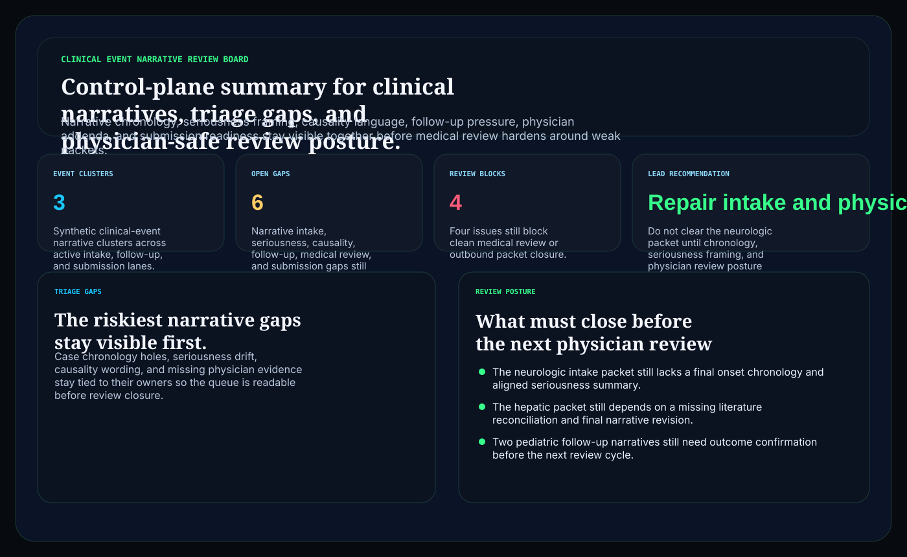
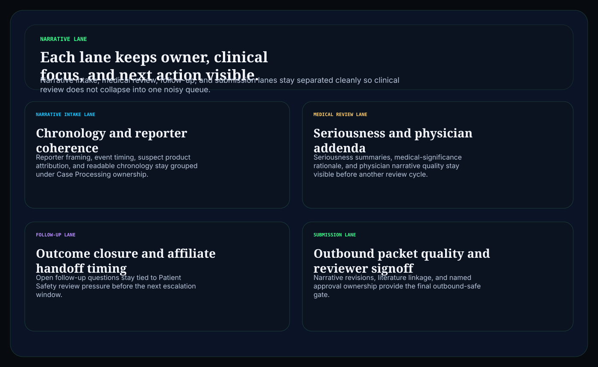
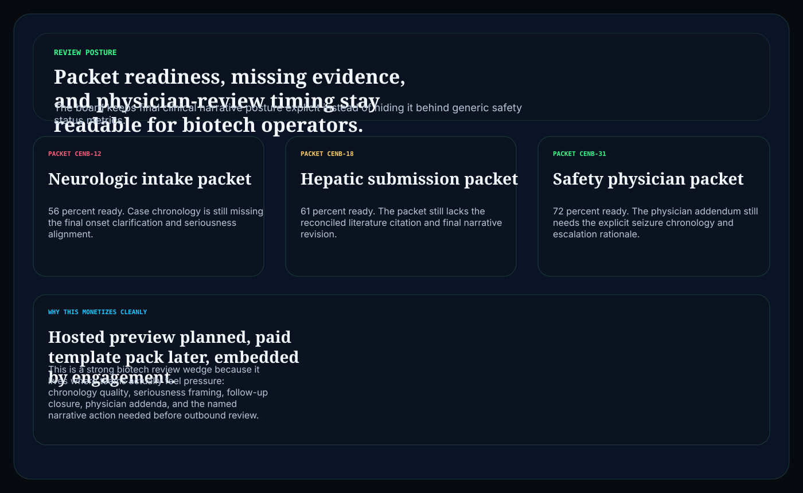

# clinical-event-narrative-review-board

C# / ASP.NET operator surface for biotech clinical-event narratives, triage gaps, physician-review posture, and submission-safe packet readiness.

## Why this matters

Biotech and diagnostics teams do not need another vague narrative-quality landing page. They need a board that keeps chronology quality, seriousness framing, causality language, follow-up closure, physician addenda, and submission readiness visible together before weak packets slip into downstream medical review.

This repo is the public proof surface for that pattern:

- `Hosted preview planned` for a browser-based clinical narrative-review board
- `Embedded by engagement` for teams that need the routing model inside a regulated clinical-event or diagnostics workflow

## What it includes

- ASP.NET Core minimal API in C#
- synthetic clinical-event snapshots, triage gaps, and review packets
- operator surfaces for:
  - `/narrative-lane`
  - `/triage-gaps`
  - `/review-posture`
  - `/verification`
  - `/docs`
- structured JSON endpoints under `/api/*`
- static Pages export with `robots.txt`, `sitemap.xml`, and `CNAME`

## Screenshots





## Verification

- synthetic clinical narrative evidence only
- no patient-identifiable, clinician, or sponsor-confidential event narratives
- no claim of GVP, FDA, EMA, or pharmacovigilance compliance
- this is a control-plane proof surface for biotech review-workflow depth, not a compliance certification claim

## Local run

```powershell
dotnet test
dotnet run --project src/ClinicalEventNarrativeReviewBoard.Api -- --demo
dotnet run --project src/ClinicalEventNarrativeReviewBoard.Api
```

Then open:

- `http://127.0.0.1:5094/`
- `http://127.0.0.1:5094/narrative-lane`
- `http://127.0.0.1:5094/triage-gaps`
- `http://127.0.0.1:5094/review-posture`

## Render static site

```powershell
dotnet run --project src/ClinicalEventNarrativeReviewBoard.Api -- --prerender
```

## Related docs

- [Embedded framing](./docs/KINETIC_GAIN_EMBEDDED.md)
- [Origin story](./docs/ORIGIN.md)
